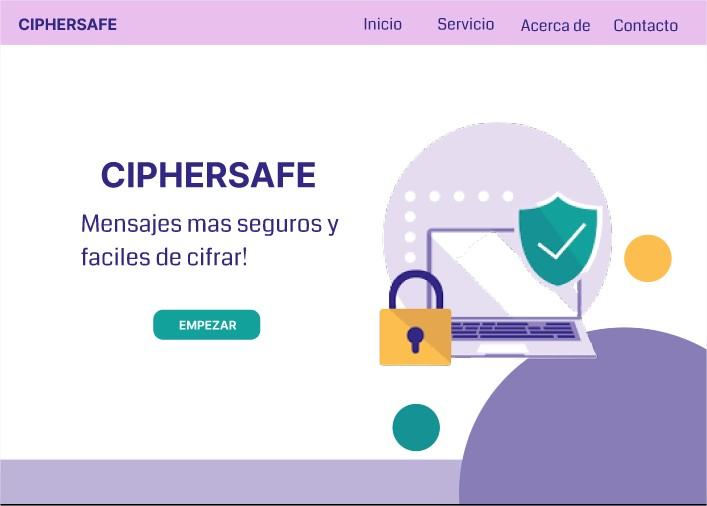
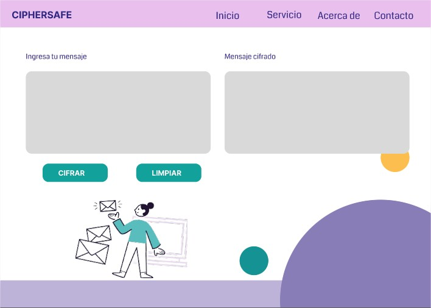

# Cifrado César - CIPHERSAFE

# Índice

* [1. Resumen del Proyecto](#1-resumen-del-proyecto)
* [2. Definición del Producto](#2-definición-del-producto)
* [3. Interfaz de Usuario (UI)](#3-interfaz-de-usuario-ui)
* [4. Prototipo del Proyecto](#4-prototipo-del-proyecto)
* [5. Objetivos de Aprendizaje](#5-objetivos-de-aprendizaje)

***
## 1. Resumen del Proyecto

CIPHERSAFE es aplicación web que permite a todos los usuarios ingresar un mensaje para ser cifrado o descifrado, los usuarios pueden elegir el numero de desplazamiento para que cuando envien o reciban un mensaje solo ellos puedan leer y asi mantener en privado las conversaciones.

***

## 2. Definición del Producto

### 2.1.  Quiénes son los principales usuarios de tu producto.
Los principales usuarios son personas en general, los cuales busquen enviar o recibir mensajes cifrados o descifrarlos.

### 2.2. Cuáles son los objetivos de estos usuarios en relación con tu producto.
Poder mantener en privacidad sus mensajes y que estás solo las puedan leer las personas quienes saben el número de desplazamiento.

### 2.3. Como crees que el producto que estas creando esta resolviendo sus problemas.
Facilita al usuario de manera sencilla y rapidad encriptar mensajes.

***

## 3. Interfaz de Usuario (UI)

La interfaz de la aplicación web permite al usuario:

* El usuario puede elegir un desplazamiento (_offset_) indicando cuántas posiciones quiere que el cifrado desplace cada caracter.
* El usuario puede ingresar un mensaje (texto) que desea cifrar o descifrar.
* El usuario puede visualizar el resultado del mensaje cifrado o descifrado.

***

## 4. Prototipo del Proyecto

### Prototipo en Figma

La realización del [prototipo del proyecto](https://www.figma.com/proto/5IX3tjz0fEknewWdULJ9uS/CIPHERSAFE-v01?node-id=1%3A2&starting-point-node-id=1%3A2) se realizo en Figma.

Vistas del prototipo:

### Prototipo Final

Presentación del [proyecto Cipher](https://rociotellezlopez.github.io/LIM018-cipher/src/).

Vistas de la Web App CIPHERSAFE:

***

## 5. Objetivos de Aprendizaje

### HTML

- [x] Uso de HTML semántico

### CSS

- [x] Uso de selectores de CSS
- [x] Modelo de caja (box model): borde, margen, padding

### Web APIs

- [x] Uso de selectores del DOM
- [x] Manejo de eventos del DOM (listeners, propagación, delegación)
- [x] Manipulación dinámica del DOM

### JavaScript

- [x] Tipos de datos primitivos
- [x] Strings (cadenas de caracteres)
- [x] Variables (declaración, asignación, ámbito)
- [x] Uso de condicionales (if-else, switch, operador ternario, lógica booleana)
- [x] Uso de bucles/ciclos (while, for, for..of)
- [x] Funciones (params, args, return)
- [x] Pruebas unitarias (unit tests)
- [ ] Módulos de ECMAScript (ES Modules)
- [ ] Uso de linter (ESLINT)
- [ ] Uso de identificadores descriptivos (Nomenclatura y Semántica)

### Control de Versiones (Git y GitHub)

- [x] Git: Instalación y configuración
- [x] Git: Control de versiones con git (init, clone, add, commit, status, push, pull, remote)
- [x] GitHub: Creación de cuenta y repos, configuración de llaves SSH
- [ ] GitHub: Despliegue con GitHub Pages

### user-centricity

- [x] Diseñar un producto o servicio poniendo a la usuaria en el centro

### product-design

- [x] Crear prototipos de alta fidelidad que incluyan interacciones

- [ ] Seguir los principios básicos de diseño visual
